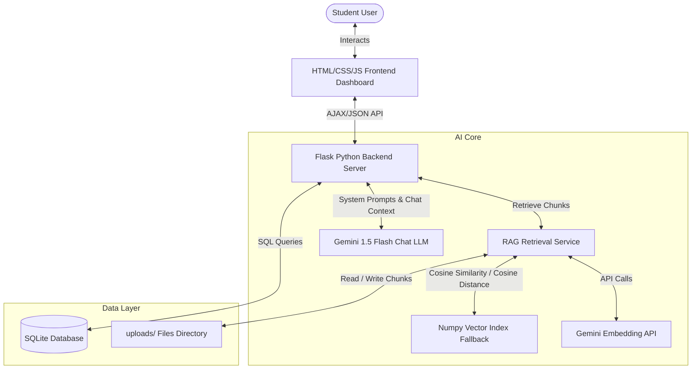

# GenAI Learning Mentor

A comprehensive, AI-powered educational web application built for students who need personalized academic coaching. The application helps students generate custom study schedules, upload notes for RAG-grounded contextual explanations, attempt adaptive quizzes, and identify performance weak areas over time.

---

## 🏗️ Architecture Design



---

## 🌟 Core Features

1. **Adaptive AI Tutor**: A conversational chat interface. The tutor defaults to a personalized persona that guides the student step-by-step.
2. **RAG-Based Learning**: Students upload notes (`.pdf` or `.txt`). Chunks are embedded using `models/text-embedding-004` and queried to answer questions grounded strictly in the course material.
3. **Study Plan Generator**: Analyzes the subject, goals, deadline, and study hours to compile weekly milestones and a detailed daily schedule.
4. **Quiz Generator**: Generates practice tests (MCQ, True/False, Short Answer) from either a general topic or uploaded notes.
5. **Weak Area Analysis**: Evaluates quiz performance, clusters incorrect responses by concept, tracks running averages, and compiles remediation strategies.
6. **Progress Dashboard**: Interactive line charts of score timelines and topic performance bar graphs using Chart.js.

---

## 📁 Repository Structure

```
GenAI Learning Mentor/
├── app.py                  # Main Flask server (API endpoints & view routing)
├── database.py             # SQLite configuration and CRUD database helpers
├── rag_service.py          # PDF parsing, recursive chunking, and Vector Index management
├── requirements.txt        # Python package dependencies
├── .env.template           # Template configuration file for environment variables
├── test_app.py             # Route & database validation test suite
├── static/
│   ├── css/
│   │   └── style.css       # Core theme styling (Modern Dark & Light styles)
│   └── js/
│       └── app.js          # Theme toggles, Chat thread logic, Quiz engine, Chart triggers
└── templates/
    ├── base.html           # Shared layout (Sidebar, profile cards, static bundles)
    ├── landing.html        # Welcome/Marketing homepage
    ├── auth.html           # Sleek register & login page
    ├── dashboard.html      # Main overview cards and activity dashboard
    ├── chat.html           # Adaptive tutoring interface
    ├── study_plan.html     # Goal parameter forms and roadmap schedule calendars
    ├── upload.html         # Drag-and-drop document upload library
    ├── quiz.html           # Custom practice test workspace
    ├── weak_areas.html     # Performance Diagnostics report card
    └── progress.html       # Analytics score visualization charts
```

---

## 🗄️ Database Schema

The system operates a lightweight SQLite database storing relational progress metrics. Below are the key data models:

* **`users`**: Logs account details.
* **`study_plans`**: Holds structured JSON calendars generated by the LLM.
* **`uploaded_materials`**: Records metadata for parsed document files.
* **`quiz_attempts`**: Records score percentages, evaluations, and questions.
* **`weak_areas`**: Holds running performance percentages and remediation logs per topic.

---

## 🚀 Setup & Execution

### Prerequisites
* Python 3.9 or higher
* Pip package manager

### 1. Installation
Clone or download the project files, open a terminal in the folder, and run:
```bash
pip install -r requirements.txt
```

### 2. Configuration
1. Rename the `.env.template` file to `.env`:
   ```bash
   copy .env.template .env
   ```
2. Open `.env` and fill in your custom credentials:
   - **`GEMINI_API_KEY`**: Acquire an API key from [Google AI Studio](https://aistudio.google.com/).
   - **`FLASK_SECRET_KEY`**: Provide a custom alphanumeric key to secure user sessions.

### 3. Run Validation Tests
Verify that the server configurations and sqlite connections are working:
```bash
python test_app.py
```

### 4. Start the Application
Boot the local development server:
```bash
python app.py
```
The server will start running on `http://127.0.0.1:5000/`. Open this link in any browser to explore the dashboard.

---

## 🎨 UI Guidelines

* **Default Mode**: Premium Dark Mode first (Deep slate backgrounds `#080c14` with indigo `#6366f1` and cyan `#06b6d4` highlights).
* **Toggle Theme**: Supported at the bottom-left sidebar toggle, switching seamlessly to a bright ice-blue light mode configuration.
* **Responsive**: Viewport media queries shift the navigation sidebar to a compact icon layout on screens below `991px`.
